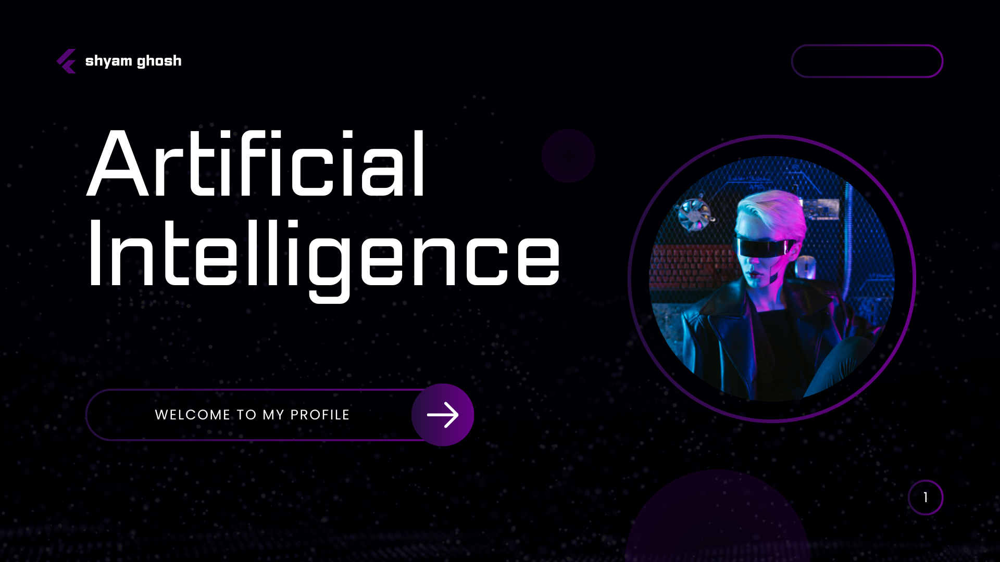
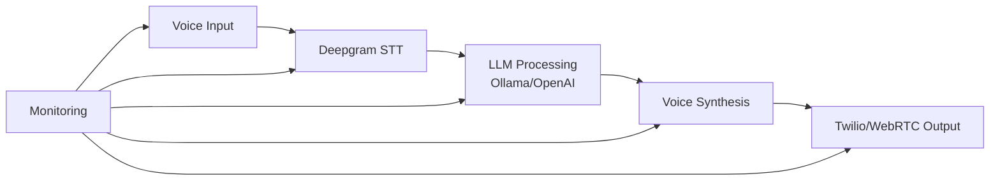

  
  
  <h1>👋 Hey, I'm Shyam</h1>
  <h3>🚀 Architecting Next-Gen AI Voice Communication Platforms</h3>
  
  

    <i>Specializing in ultra-low latency, real-time AI voice agents that transform business communications</i>
  

  
  

    
  

  
  

    
    
  

---

## 🎯 **Core Focus Areas**

| Domain | Expertise |
|--------|-----------|
| **🤖 AI Voice Agents** | ElevenLabs/Vapi-style platforms, real-time conversational AI |
| **⚡ Low-Latency Systems** | Sub-1s response time optimization, WebSocket streaming |
| **📞 Voice Infrastructure** | Twilio alternatives, SIP integration, telephony systems |
| **🛠️ Production AI** | LLM orchestration, voice synthesis, enterprise deployment |

---

## 🛠 **Technology Stack**

### **AI & Machine Learning**

### **Backend & Infrastructure**

### **Voice & Telephony**

---

## 🌟 **Featured Projects**

### **[🚀 AI Voice Calling Platform](https://github.com/SHYAMIII/Elevenlabs-alternative-service)**
> **Production-ready alternative to ElevenLabs/Vapi**
- 🔹 **Real-time** AI agents for inbound/outbound calls
- 🔹 **<1s latency** voice response system
- 🔹 **Multi-LLM** orchestration (Ollama, OpenAI, Anthropic)
- 🔹 **Scalable** WebSocket architecture
- 🔹 **Enterprise-grade** telephony integration

### **[🤖 AI Sales Development Representative](https://github.com/SHYAMIII)**
> **Autonomous lead qualification & outreach system**
- 🔸 **Natural** human-like conversations
- 🔸 **Real-time** sentiment analysis
- 🔸 **CRM** integration capabilities
- 🔸 **Custom** persona configuration

### **[⚡ Voice Streaming Infrastructure](https://github.com/SHYAMIII)**
> **High-performance audio processing pipeline**
- 🔹 **WebRTC** & SIP protocol support
- 🔹 **Noise cancellation** & audio enhancement
- 🔹 **Load-balanced** horizontal scaling
- 🔹 **Monitoring** & analytics dashboard

---

## 📈 **Architecture Philosophy**

**Key Principles:**
- **Minimal Latency**: Every millisecond counts in voice conversations
- **Resilient Architecture**: Graceful degradation & failover mechanisms
- **Scalable Design**: Cloud-native, containerized deployment
- **Developer Experience**: Clean APIs, comprehensive documentation

---

## 📬 **Let's Collaborate**

I'm actively seeking opportunities to:

- **👥 Collaborate** on cutting-edge AI voice projects
- **🏢 Consult** for enterprise voice AI implementations
- **🚀 Build** production-ready voice SaaS platforms
- **💡 Innovate** in real-time communication technology

**Preferred Engagement Models:**
- Technical co-founder roles
- Enterprise contracts & consulting
- Open-source collaborations
- SaaS product development

---

  
  **📧 Reach Out:** [shyamghosh2004@gmail.com](mailto:shyamghosh2004@gmail.com)
  
  
  
  
  
  *"Transforming conversations with AI"*

